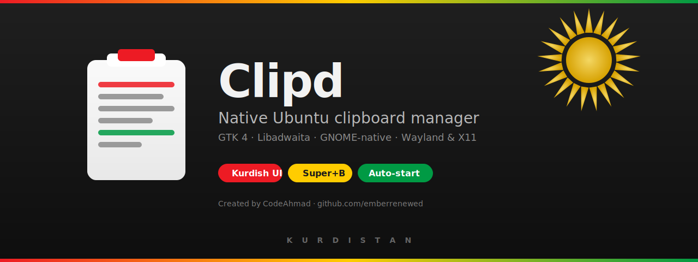

<!--
  This is the README intended for the PUBLIC release repository
  (e.g. emberrenewed/Ubuntu-Clipboard-Releases or just
   emberrenewed/Ubuntu-Clipboard if you keep source private elsewhere).

  Copy this file to README.md inside the public release repo. It contains
  no source-code references and only points users at the .deb download.
-->

<div align="center">



# Clipd

### A native, GNOME-quality clipboard manager for Ubuntu.

[](../../releases/latest)
[](../../releases/latest)
[](https://github.com/emberrenewed)

</div>

---

## ⚡ Quick install

```bash
sudo apt install -y python3-gi gir1.2-gtk-4.0 gir1.2-adw-1 \
  gir1.2-ayatanaappindicator3-0.1 xclip wl-clipboard libnotify-bin

# Download the latest .deb from the Releases page
wget https://github.com/emberrenewed/Ubuntu-Clipboard/releases/latest/download/clipd_0.1.0_amd64.deb

sudo apt install ./clipd_0.1.0_amd64.deb
systemctl --user enable --now clipd.service
```

Press **Super + B** to open Clipd. (Configure the shortcut once in
**Settings → Keyboard → Custom Shortcuts** with command `clipd`.)

---

## ✨ Features

- **Captures everything** — text, code, URLs, rich text, images, screenshots, files
- **Native GTK 4 + Libadwaita UI** — feels like a first-party Ubuntu utility
- **Wayland & X11** — works on GNOME, KDE, sway
- **Privacy-first** — fully local SQLite, skips password manager content, detects keys/OTP/CC#
- **Full Sorani Kurdish UI** — RTL layout, hand-curated translation
- **Optional Kurdistan theme** — bundled flag background, custom image upload
- **Auto-start** — systemd user service, survives reboots
- **Super+B shortcut** — one keypress to open the history

---

## 🐛 Bug reports

Report issues on the [Issues page](../../issues). Include:

```bash
systemctl --user status clipd.service --no-pager | head -10
journalctl --user -u clipd.service --no-pager | tail -50
```

---

## 📜 License

Proprietary © 2026 CodeAhmad. Free to install and use; redistribution,
modification, and reverse engineering are not permitted.

Built by [CodeAhmad](https://github.com/emberrenewed).
